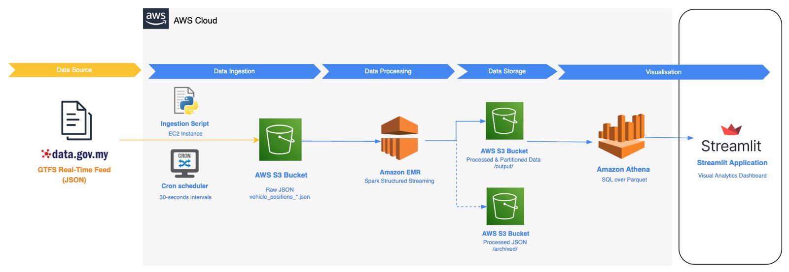
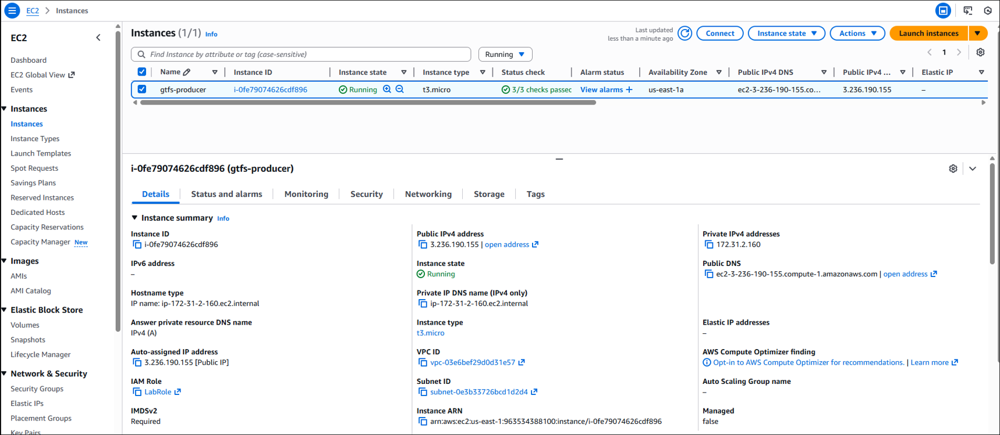
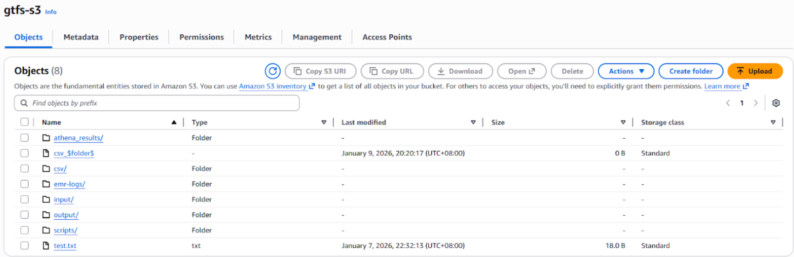
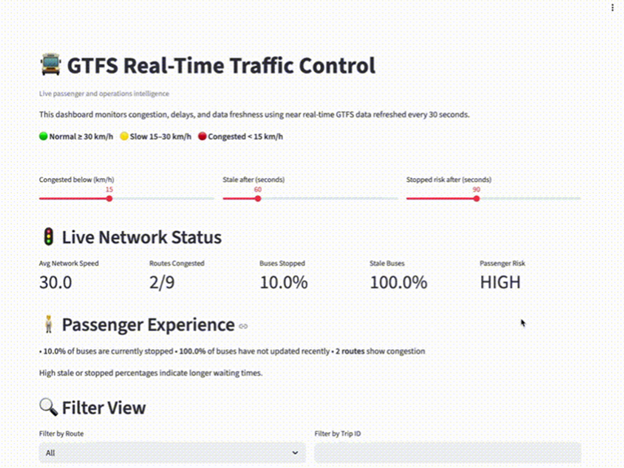
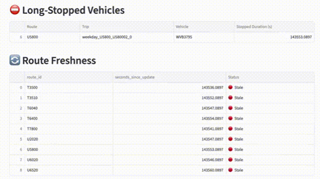

# AWS-Based-NRT-Public-Transport-Monitoring-System

## Introduction
Public transport systems increasingly rely on near real-time data to improve service reliability and provide passengers with accurate transport arriving times and schedule information to improve commute efficiency. The General Transit Feed Specification Real-Time (GTFS-RT)  API allows transit agencies to share real-time updates such as vehicle locations, trip and timing changes, or any alerts on services. This project focuses on designing and deploying a distributed, cloud-based monitoring system that leverages GTFS near real time feeds at a large scale and processes the data in near real-time using AWS managed services.

## System Architecture
<p align="center">
  
</p>

## Pre-requisites
A shared AWS environment was configured to support collaborative development of a near real-time bus monitoring dashboard. The following setups focus on secure authentication, shared access to compute, and a common workspace.

<p align="center">
  
</p>

An AWS EC2 instance is created to serve as a central compute node for hosting required scripts to run the application. It is also used to provide a shared environment with a single operating system to run the same command line tools for all users. It is configured with an Amazon Linux AMI for a linux based operating system and a t3 micro instance type. An IAM LabRole is attached to the instance to provide users of the instance access to AWS services such as creating EMR clusters, setup S3, etc. A security group is configured with inbound rules to permit different kinds of network traffic into the system. Port 22 is opened for remote access from specific IP addresses into the EC2 using SSH and port 8501 is opened to allow members to access the Streamlit dashboard using a public URL. To access the EC2 instance as the admin, the following steps are implemented:

<details>
  <summary><strong>Accessing the EC2 Instance</strong></summary>

  1. When launching the EC2 instance from the AWS Management Console, generate a SSH key pair which will automatically download.
  2. The following command was used to login to the instance using the downloaded SSH key pair file.
     ```
     ssh -i <ssh-key.pem> ec2-user@<public IP of instance>
     ```
  3. After logging in, users are created for group members using the following command:
     ```
     sudo adduser <username>
     ```
  4. Each member generates a SSH key-pair using RSA algorithm and provide the public key to admin.
  5. An authorized keys file is created for each member to store their respective SSH public keys and provide read write permissions using the following command:
     ```
     sudo mkdir /home/<username>/.ssh
     sudo nano /home/<username>/.ssh/authorized_keys
     sudo chown -R <username>:<username> /home/<username>/.ssh
     sudo chmod 700 /home/<username>/.ssh
     sudo chmod 600 /home/<username>/.ssh/authorized_keys
     ```
</details>

<details>
  <summary><strong>Creating a Shared Project Directory</strong></summary>
  
  A shared project directory is created to store all scripts required to run the system along with log and config files. To manage every team member's permissions, a Linux group is created.
  Each user is added to that group and the ownership of the group is given to the admin account. Read and write permissions are provided to the owner and the group for the directory. The following code is used:
  ```
  sudo mkdir -p /wqd7008/aws-project
  sudo groupadd gtfs
  sudo usermod -aG <username>
  sudo chown ec2-user:gtfs /wqd7008/aws-project
  sudo chmod 775 /wqd7008/aws-project
  ```
</details>

<details>
  <summary><strong>Creating a S3 Bucket</strong></summary>
  Amazon S3 is the primary storage system serving each layer of the pipeline. It provides scalable, durable and flexible storage for any raw and processed data, allowing easy access and integration with other AWS services. To support the storage of data at every layer and all log files, a S3 bucket called ‘gtfs-s3’ was created.
  
  <p align="center">
    
  </p>
</details>

## Deployment

### Data Ingestion
Vehicle data is ingested by polling the GTFS API in JSON format from the data.gov.my endpoint at the set time interval. The python script `gtfs_to_s3.py` is developed and stored in the project directory on the EC2 instance. It writes the retrieved data to an Amazon S3 bucket under the /input/directory. Each output file includes a timestamp in the filename which allows the system to track recency and processing order.

### Data Processing
Amazon EMR cluster is created to support distributed batch processing of GTFS vehicle position data that is stored within S3 bucket as a JSON file. The cluster is created using EMR release 6.15.0 with Apache Spark and parameter instance-count is set to 2 to configure the cluster with a master node and a worker node to enable distributed computing of continuously incoming large-scale vehicle data. The configuration is as follows:
```
aws emr create-cluster \
--name GTFS EMR-BATCH \
--release-label emr-6.15.0 \
--applications Name=Spark \
--use-default-roles \
--instance-type m5.xlarge \
--instance-count 2 \
--log-uri s3://gtfs-s3/emr-logs/
```

Apache Spark Structured Streaming is used to implement the following processing steps: 
1. Data Validation - This step ensures each record follows the expected GTFS format. 
2. Transformation - The system cleans and standardizes the data, where it aligns fields such as vehicle IDs, trip details, time values, and location points. 
3. Aggregation - The system derives metrics for different granularities like trip and route level.

The PySpark application code is written to a python script called `spark_gtfs_emr_final.py` and uploaded into the S3 bucket. The Spark job is submitted to the EMR cluster using a bash script called `run-emr.sh` after dynamically selecting the most recent GTFS vehicle position file stored in the S3 bucket. 

### Automation and Scheduling

A cron scheduler is configured on the EC2 instance to automate the ingestion process. The first step of the scheduler triggers the `gtfs_to_s3.py` script every 30 seconds, with the first entry running at the start of the minute and second entry running after a 30-second delay. Log output is written to a local log file to verify script execution and error tracking. Crontab is installed on the EC2 instance before running the following command in the instance to automate the ingestion and processing pipeline:

```
* * * * * /usr/bin/python3 /wqd7008/aws-project/gtfs_to_s3.py >> /wqd7008/aws-project/logs/cron.log 2>&1
* * * * * sleep 30; /usr/bin/python3 /wqd7008/aws-project/gtfs_to_s3.py >> /wqd7008/aws-project/logs/cron.log 2>&1
```
After the ingestion has completed, the Spark cron job executes to read the latest vehicle position file from S3. With this, Spark processes the data and writes updated Parquet and CSV outputs back to S3 for storage purposes.

```
* * * * * /bin/bash /wqd7008/aws-project/run_emr.sh >> /wqd7008/aws-project/logs/emr_cron.log 2>&1
* * * * * sleep 30; /bin/bash /wqd7008/aws-project/run_emr.sh >> /wqd7008/aws-project/logs/emr_cron.log 2>&1
```

## Dashboard

A near real-time visualization dashboard is developed using Streamlit to present insights in an interactive and user-friendly manner. The visualization layer accesses processed data through Amazon Athena, which is configured to read Parquet datasets stored in an Amazon S3 bucket. Athena tables for latest vehicle positions, trip level metrics and route level metrics are created. Streamlit issues SQL queries to these tables at each refresh cycle, and Athena retrieves the most recent processed results from S3 and stores them as pandas dataframes. These dataframes are used to provide data for the visualizations. This architecture avoids direct file handling in the dashboard while maintaining a clear separation between data storage, processing, querying, and presentation layers.

The dashboard provides interactive visual analytics that support monitoring of transit system performance, including:
  * Real-time vehicle movement patterns visualized through a live geographic map of vehicle positions
  * Route-level traffic and speed trends, summarised through aggregated performance metrics
  * Service reliability and operational indicators such as stopped vehicles, congested routes, and data freshness metrics derived from update timestamps

<p align="center">
  
</p>

<p align="center">
  
</p>

<p align="center">
  
</p>

## System Monitoring

For monitoring system performance and logs produced by each application, Amazon CloudWatch is used. To integrate the logs stored in the shared directory of the EC2 instance with CloudWatch, Amazon CloudWatch Agent was installed on the instance. A configuration file called `amazon-cloudwatch-agent.json` in the /etc/ directory of aws/amazon-cloudwatch-agent was configured to inform CloudWatch the locations to fetch the logs from. The CloudWatch Agent was executed using the command:

```
sudo /opt/aws/amazon-cloudwatch-agent/bin/amazon-cloudwatch-agent-ctl -a fetch-config -m ec2 -c file:/opt/aws/amazon-cloudwatch-agent/etc/amazon-cloudwatch-agent.json -s
```

Each log file is mapped to a separate log group in AWS; cron.log is mapped to /gtfs/ec2/poller and emr_cron.log is mapped to /gtfs/ec2/emr. The agent generated unique log stream IDs for each log group.


